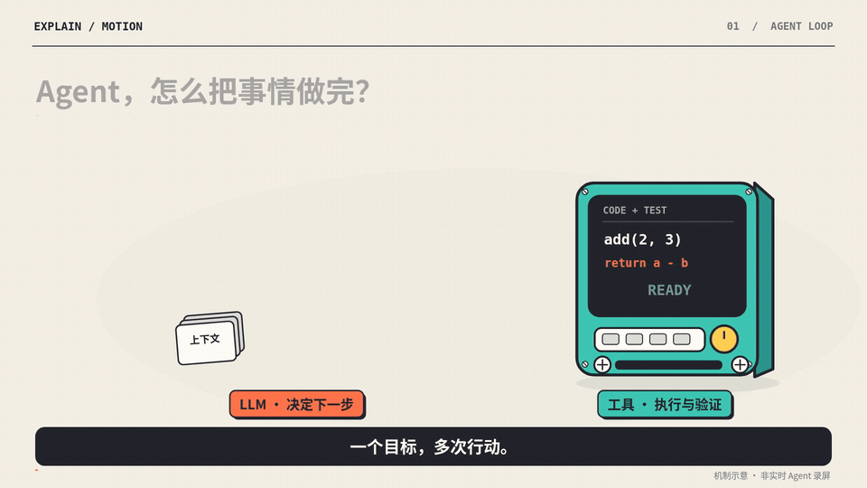
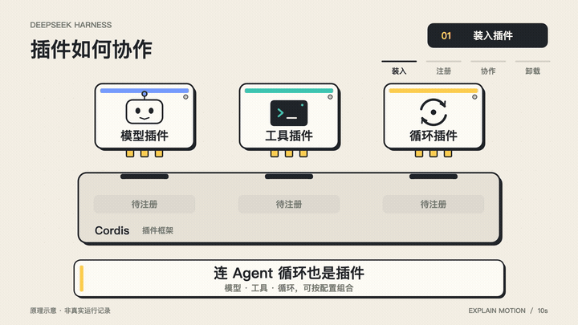
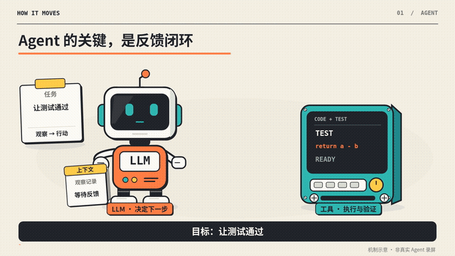
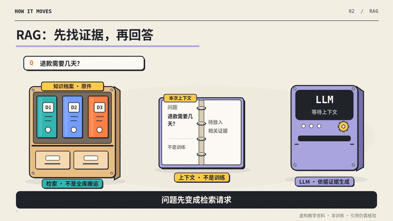
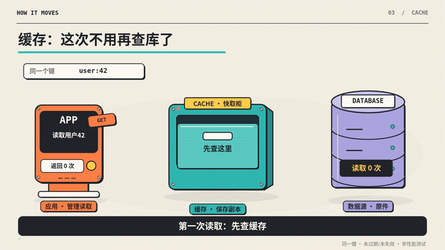
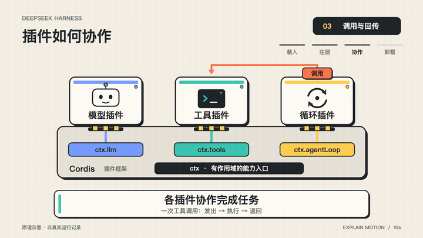

<!-- HOW-IT-MOVES:CURRENT:BEGIN -->
## Current production entry: v0.8 · Mechanism-first

Typed events precede action-derived asset plans and real image generation. Per-event visual evidence is separate from engine tests. Academic handoff needs a source ledger and separate instructor sign-off.

[Setup and workflow](technical-animation/README.md) · [Skill](technical-animation/SKILL.md) · [Capabilities and limits](technical-animation/references/capabilities.md)

Older showcase media remain historical, not newly certified by v0.8. No universal physics or learning-outcome claim.
<!-- HOW-IT-MOVES:CURRENT:END -->

# How It Moves

**Topic-specific artwork, causal motion, and HTML / MP4 / SVG delivery.**

[中文](README.md) · [Original interactive demo](docs/index.html) · [Recipe gallery](docs/recipes/index.html) · [Skill](technical-animation/SKILL.md) · [MIT](LICENSE)

[](https://wz20.github.io/how-it-moves/)

Click an animation to open its interactive preview, with playback, pause, and frame-by-frame seeking.

[Original 1080p60 MP4](docs/media/agent-loop-10s.mp4)

## v0.6 · Topic-specific artwork and multiple output formats

Design three visual worlds for each new topic, then use the host's image-generation tool to create project-specific subjects and movable parts. Historical props are references, not the default asset library for new subjects.

Choose offline interactive **HTML**, silent **MP4**, or a static layered **SVG** with editable text/paths and embedded raster artwork. SVG is hybrid, not pure vector. All formats share the scene contract and require explicit visual review; source, asset or exporter changes invalidate approval.

```bash
python3 technical-animation/scripts/create.py init --topic "Mechanism to explain" --formats html svg --out work/my-topic
python3 technical-animation/scripts/create.py prompts work/my-topic --out work/my-topic/generation-briefs.md
# Generate real artwork through the host and complete story.json.
python3 technical-animation/scripts/create.py check work/my-topic
python3 technical-animation/scripts/create.py review work/my-topic --folder review-v1
# Inspect the artwork and motion, then record per-shot findings.
python3 technical-animation/scripts/create.py export work/my-topic --formats html svg --review work/my-topic/review-v1/review.json --out build/my-topic-v1
```

[Output formats](technical-animation/references/output-formats.md) · [Topic design](technical-animation/references/topic-design.md) · [Production contract](technical-animation/references/production-contract.md)

The host must provide image generation and visual inspection. Tests use synthetic fixtures and do not demonstrate artwork quality. Existing demos below are preserved v0.1–v0.4 examples, not v0.6 artwork evaluations.

<!-- ILLUSTRATED-STUDIO:BEGIN -->
## v0.4 · Physical comic assets, content-only authoring

Original artwork is preserved and the three mechanism demonstrations are rebuilt using a shared, content-driven illustrated presentation. The renderer owns the props, poses and camera; the model edits validated content only. No weaker-model or audience benchmark is claimed.

```bash
python3 technical-animation/scripts/illustrate.py init --recipe feedback-retry --out work/agent.json
python3 technical-animation/scripts/illustrate.py check work/agent.json
python3 technical-animation/scripts/illustrate.py build work/agent.json --out build/agent-v1 --render
```

[Guide / 使用指南](technical-animation/references/illustrated-mode.md) · [All three demos](docs/illustrated/index.html)

18–40s · 1920×1080 · 30/60fps · silent / 无声。Old demos are preserved / 原版保留。
<!-- ILLUSTRATED-STUDIO:END -->

## Animation showcase

### DeepSeek Harness: how plugins work · 10s

[](https://wz20.github.io/how-it-moves/deepseek-plugins.html)

Advanced mode: mount → register → call and return → unload and clean up.

[▶ Interactive preview](https://wz20.github.io/how-it-moves/deepseek-plugins.html) · [MP4](docs/media/deepseek-plugins.mp4)

### Feedback and retry · 20s · Illustrated Studio

[](https://wz20.github.io/how-it-moves/illustrated/feedback-retry.html)

Original jointed robot and physical terminal. Feedback changes the next action.

[▶ HTML](https://wz20.github.io/how-it-moves/illustrated/feedback-retry.html) · [1080p60 MP4](docs/illustrated/media/feedback-retry.mp4)

### Retrieval and evidence · 20s · Illustrated Studio

[](https://wz20.github.io/how-it-moves/illustrated/retrieval-evidence.html)

Archive originals stay put. Evidence copies enter a ring binder; the press prints a cited answer.

[▶ HTML](https://wz20.github.io/how-it-moves/illustrated/retrieval-evidence.html) · [1080p60 MP4](docs/illustrated/media/retrieval-evidence.mp4)

### Cache miss and hit · 22s · Illustrated Studio

[](https://wz20.github.io/how-it-moves/illustrated/cache-aside.html)

A physical drawer opens empty, stores a key/value copy, and serves the next hit.

[▶ HTML](https://wz20.github.io/how-it-moves/illustrated/cache-aside.html) · [1080p60 MP4](docs/illustrated/media/cache-aside.mp4)

<details>
<summary>Supplement: DeepSeek call/return motion test · 3s</summary>



[MP4](docs/media/deepseek-plugins-action-test.mp4)

</details>

The DeepSeek [editable project](technical-animation/examples/deepseek-plugins/) and [verification limits](technical-animation/examples/deepseek-plugins/README.md) are included. It is an advanced-mode example, not a new generic recipe. All examples are silent mechanism illustrations, not live execution recordings; no audience study has been performed.

## What changed

v0.1 asked the host agent to design and implement `scene.mjs`. The historical v0.2 path uses bounded recipes: choose the right mechanism and edit a small JSON document. The compiler supplies layout, layered vector assets, articulated motions, integer-frame event scheduling, captions, and the final two-second reading hold.

This removes model responsibility for animation engineering **inside supported mechanisms**. It does not make a model understand unfamiliar technology, prove factual statements, execute actual tools, or guarantee educational quality. No weaker-model benchmark or audience study has been performed; see [evaluation protocol](technical-animation/evals/README.md).

## Legacy recipes (preserved)

| Recipe | Mechanism | Interactive | Video |
|---|---|---|---|
| feedback-retry | Failed test → feedback → repair → retest → stop | [12s HTML](docs/recipes/feedback-retry.html) | [MP4](docs/recipes/media/feedback-retry.mp4) |
| retrieval-evidence | Query → selected evidence → context → cited answer | [12s HTML](docs/recipes/retrieval-evidence.html) | [MP4](docs/recipes/media/retrieval-evidence.mp4) |
| cache-aside | Miss → application reads origin and fills cache → subsequent hit | [14s HTML](docs/recipes/cache-aside.html) | [MP4](docs/recipes/media/cache-aside.mp4) |

All are original mechanism illustrations using fictional teaching data, not live model/database/retrieval execution. The Agent recipe does not execute the displayed patch. RAG depicts inference-time evidence, not training. Cache-aside assumes the same unexpired, non-invalidated key; it does not teach write consistency.

## Legacy recipe entry point

From the repository root, with Python 3.10+:

```bash
python3 technical-animation/scripts/recipe.py list
python3 technical-animation/scripts/recipe.py init --recipe retrieval-evidence --out work/rag.json
# Edit ONLY the allowed content/title/takeaway fields.
python3 technical-animation/scripts/recipe.py check work/rag.json
python3 technical-animation/scripts/recipe.py build work/rag.json --out build/rag-v1
```

Open `build/rag-v1/preview.html`. HTML compilation uses only Python's standard library; it needs no API key, Node, image service or browser installation. The standalone preview embeds its JavaScript and uses system fonts. Install a legally licensed CJK font on systems lacking Chinese glyphs; font files are not distributed.

To revise, edit JSON and build into `rag-v2`. Existing output is refused. Do not directly edit generated `project.json`, `scene.mjs` or runtime files to bypass checks.

A complete minimal configuration:

```json
{
  "schema_version": 1,
  "recipe": "cache-aside",
  "title": "Cache: avoid the second DB read",
  "takeaway": "Miss loads from origin; hit returns directly",
  "content": {"request": "Read user 42", "key": "user:42", "value": "Ada"}
}
```

Defaults: 12/12/14 seconds depending on recipe; minimum 10/12/12, maximum 40 seconds. Only **16:9, 1920×1080, 30/60fps, silent comic-lab** are currently supported in recipe mode. Unsupported ratios, styles, audio and mechanism types fail explicitly.

[Full examples](technical-animation/recipes/) · [JSON Schema](technical-animation/schemas/recipe.schema.json) · [Recipe guide and repair instructions](technical-animation/references/recipe-mode.md)

## Install as a Skill

Copy the **whole** `technical-animation/` directory, not only `SKILL.md`.

- Local Codex: `~/.agents/skills/technical-animation/` or project `.agents/skills/technical-animation/`.
- Local Claude Code: `~/.claude/skills/technical-animation/` or project `.claude/skills/technical-animation/`.

Back up/merge an existing installation. A host must have local file and command tools; a cloud chat does not automatically read your computer's skill directories.

Prompt:

```text
Use technical-animation in explicitly requested legacy recipe mode for a 12-second RAG explainer.
Show query, selected evidence, context and cited answer. 16:9, comic-lab, silent.
Read the recipe guide, copy retrieval-evidence JSON, edit content only.
Do not write Canvas, coordinates, easing or a new scene.mjs.
Check the spec, allow at most two targeted repair attempts, then build and review.
If no recipe matches, report that instead of relabeling another mechanism.
Deliver standalone HTML and MP4 when rendering dependencies are available.
Do not call structural validation proof of factual correctness.
```

## Render MP4

```bash
python3 -m venv .venv
source .venv/bin/activate
# Windows PowerShell: .venv\Scripts\Activate.ps1
python -m pip install -r technical-animation/requirements.txt
python -m playwright install chromium
# Install ffmpeg + ffprobe separately (e.g. brew install ffmpeg).
python technical-animation/scripts/recipe.py doctor
python technical-animation/scripts/render.py build/rag-v1 --out build/rag-v1/video.mp4
```

Or append `--render` to the build command. Rendering requires Playwright/Chromium, FFmpeg/ffprobe, and installed CJK fonts. An existing Chromium can be passed via `--browser` / `CHROMIUM_PATH`. Default MP4 is H.264 CRF 16, high-quality lossy encoding, **not lossless**. No audio stream is included. The renderer checks decoding, frame count, dimensions, duration and random-access determinism.

## Guardrails and limits

Inputs reject unknown fields, malformed types, overlong text, duplicate document IDs, citations outside selected evidence, ambiguous statuses, unchanged patches and impossible durations. Runtime measures wrapped text and refuses overflow rather than making it unreadably small. Compiler events drive both animation and semantic-state checks; receiving state changes only upon arrival/completion.

Errors include `code`, `field`, `message`, and `hint`. After two targeted repairs, stop instead of rewriting validators. Generated files have checksums. This is a production aid, **not a security sandbox or a semantic/factual proof system**.

## Advanced mode remains available

[Freeform mode](technical-animation/references/freeform-mode.md) retains the previous authoring path and reusable vector/motion library. New mechanisms, layouts, styles, ratios and bespoke cameras require actual authoring and review, not arbitrary relabeling of existing recipes.

```bash
python3 technical-animation/scripts/new_project.py --topic "TCP congestion control" --duration 15 --out ../tcp-animation
```

## Verification

```bash
python3 -m unittest discover -s technical-animation/tests -v
python3 -m unittest discover -s tests -v
node technical-animation/tests/test_motion.mjs
python3 technical-animation/tests/check_recipe_browser.py --out build/recipe-checks
python3 scripts/check_release.py
```

[Recorded checks](release-checks/v0.2/README.md) distinguish actual fixture/compiler/browser/media checks from unrun model and learner evaluations. Do not infer universal model performance from these tests.

MIT applies to original code, documentation, vector assets and included example renders. Dependencies retain their own licenses. No personal photos, third-party creator assets, fonts, credentials or browser binaries are bundled. [NOTICE](NOTICE.md) · [Contributing](CONTRIBUTING.md) · [Security](SECURITY.md)

## Publish

Use an authenticated, write-capable GitHub environment. A read-only connector cannot create a repository. The publication helper checks identity and manifest, refuses an existing repository, creates a new public repo, verifies the pushed commit, and configures `main:/docs` for Pages. Deployment may still be pending after configuration.

```bash
gh auth login --hostname github.com --git-protocol https --web
python3 scripts/publish_github.py --owner YOUR_LOGIN --repo how-it-moves --public
```

Never send tokens in chat or commit them. [Publishing details](docs/PUBLISHING.md)

Primary references: [Agent Skills](https://agentskills.io/specification), [Skill authoring](https://platform.claude.com/docs/en/agents-and-tools/agent-skills/best-practices), [Agent feedback](https://www.anthropic.com/engineering/building-effective-agents), [RAG](https://arxiv.org/abs/2005.11401), [Cache-aside](https://learn.microsoft.com/en-us/azure/architecture/patterns/cache-aside).

**Localization:** Configurable titles and content can use other languages within the width budget; built-in UI, captions, and diagnostics currently use Chinese. Full localization requires an advanced preset; this release does not claim complete English narration/caption support.
